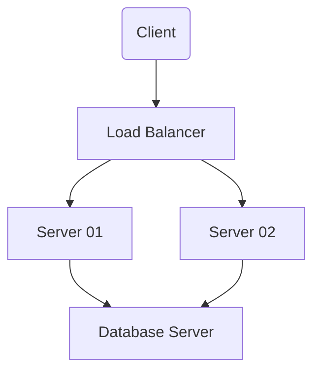
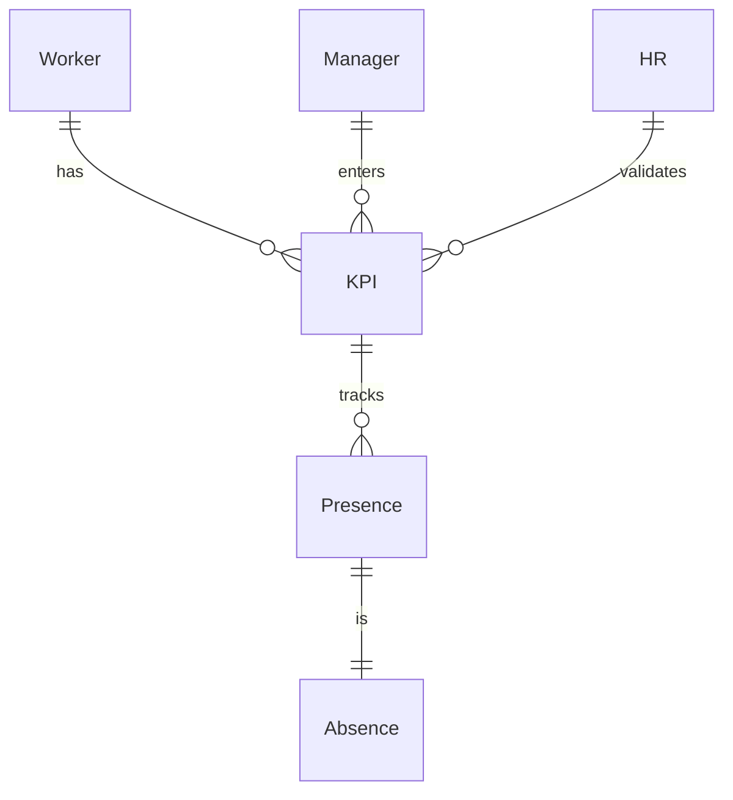
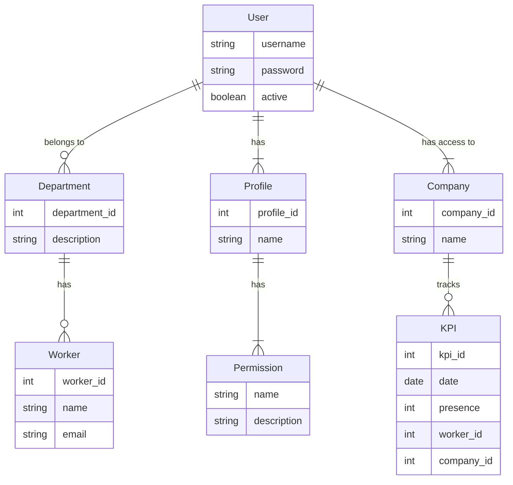

# Lista de diagramas

Essa é a lista dos diagramas UML utilizados na etapa de análise do projeto.

- [Diagrama de caso de uso usando PlantUML](#diagrama-de-caso-de-uso)
- [Diagrama Entidade-Relacionamento utilizando Mermaid](#diagrama-entidade-relacionamento--der-)
---
## Links úteis durante o desenvolvimento
- [Documentação do PlantUML](https://plantuml.com/use-case-diagram)
- [Documentação do Mermaid](https://mermaid.js.org/config/Tutorials.html)

## Diagrama de caso de uso

```plantuml

actor "IT" as IT
actor "HR" as HR
actor "Manager" as Manager
actor "Worker" as Worker

rectangle "Portal KPI" {
    IT --> (Manutenção)
    IT --> (Desenvolvimento de novas funcionalidades)

    HR --> (View KPI data)
    HR --> (Validate/approve KPI data)
    HR --> (Generate KPI reports)

    Manager --> (Enter KPI data)
    Manager --> (View historical KPI data)
    Manager --> (Request validation/approval)

    Worker --> (View own KPI data)
    Worker --> (View historical KPI data)
    Worker --> (Report issues/errors)
}
```

```plantuml
actor IT
actor HR
actor Manager
actor Worker

rectangle KPIManagementWebsite {
    IT --> (Access Dashboard)
    IT --> (Perform Maintenance)
    IT --> (Develop Features)

    HR --> (View KPIs)
    HR --> (Validate KPIs)
    HR --> (Generate Reports)

    Manager --> (Enter KPIs)
    Manager --> (View Historical KPIs)
    Manager --> (Request Validation)

    Worker --> (View Own KPIs)
    Worker --> (View Historical KPIs)
    Worker --> (Report Issues)

    (Access Dashboard) --> (View System Metrics)
    (Access Dashboard) --> (View Logs)
    (View KPIs) --> (Related to Worker Presence/Absence)
    (Enter KPIs) --> (Related to Worker Presence/Absence)
    (View Historical KPIs) --> (For Workers Managed)
    (View Historical KPIs) --> (To Monitor Own Performance)
}
```

## Diagrama Entidade-Relacionamento (DER)





