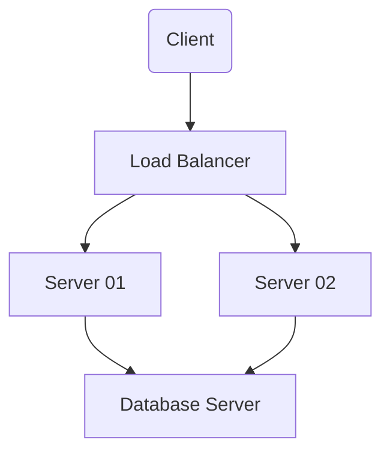

# Lista de diagramas

Essa é a lista dos diagramas UML utilizados na etapa de análise do projeto.

- [Diagrama de caso de uso usando PlantUML](#diagrama-de-caso-de-uso)
- [Diagrama Entidade-Relacionamento utilizando Mermaid](#diagrama-entidade-relacionamento--der-)
---
## Links úteis durante o desenvolvimento
- [Documentação do PlantUML](https://plantuml.com/use-case-diagram)
- [Documentação do Mermaid](https://mermaid.js.org/config/Tutorials.html)

## Diagrama de caso de uso

```plantuml

:Gestor:

:Colaborador:

:RH:

:TI:
```

## Diagrama Entidade-Relacionamento (DER)

